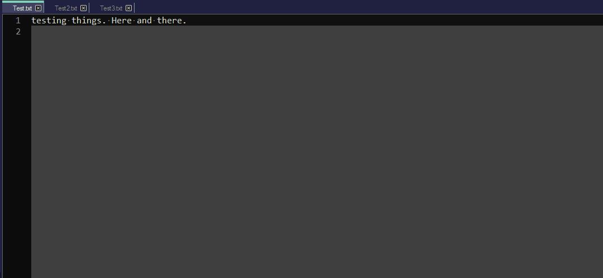
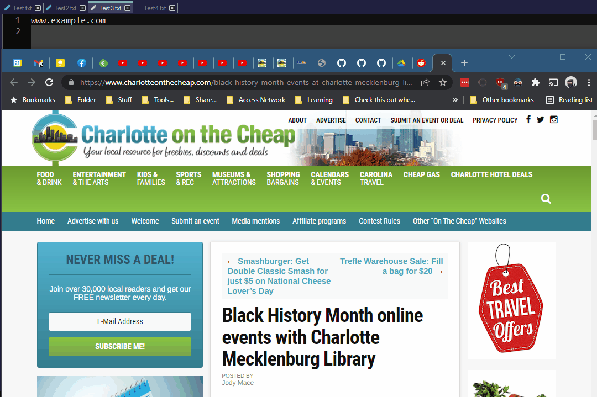
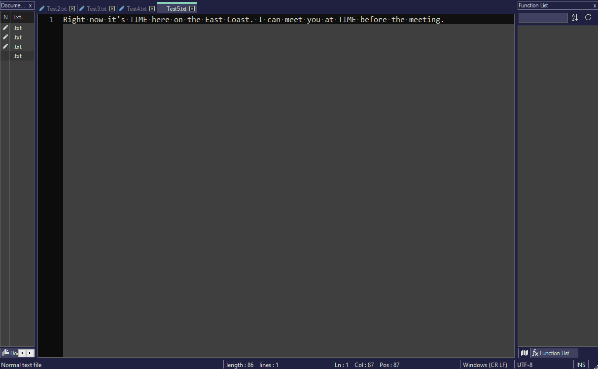

# AutoHotkey-scripts
My collection of AHK scripts I created or put together (sources/inspiration in the source code)

## capslock.ahk
Replace the caps lock key with a new custom menu for modifying text, launching scripts, or launching files/pages.

### String Manipulation

### Advanced String Manipulation

### Wrap Strings

### Browser Search

### File Manipulation

### Run Scripts

### Time Strings

## spotifyHotkeys.ahk 
Shortcuts to add currently playing songs to particular playlists or seek forward/backwards using media button keys on my keyboard

## myScripts.ahk 
text expansion + macros

## timeGUI.ahk
Use a popup window to convert time zones and save to clipboard
